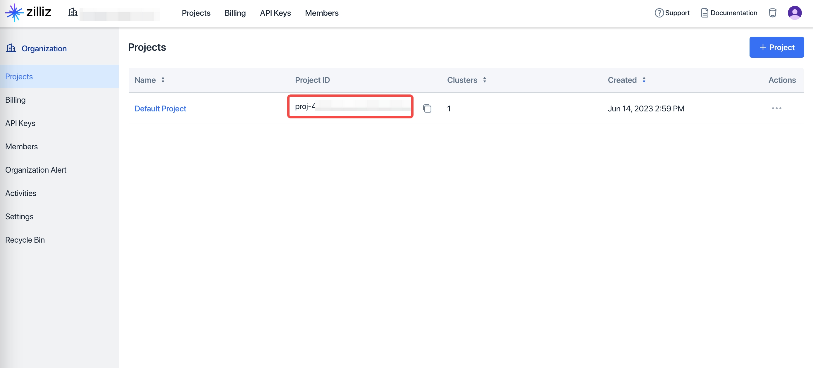

# 史料RAG
本项目展示如何使用[向量数据库](https://zilliz.com.cn/)基于[RAG(检索增强生成)](https://zhuanlan.zhihu.com/p/643953182)方式搭建一个中国历史问答应用。这个应用接受用户的询问，从历史语料库中检索相关的历史资料片段，利用大语言模型给出较为可靠的回答。相比于直接询问大模型，这种方式具有回答准确率高，不容易产生大模型的“幻觉”问题等优点。


本项目实现了两种使用方式，“Milvus方案“在本地启动一个Milvus向量数据库的Docker服务，使用LlamaIndex框架和本地`BAAI/bge-base-zh-v1.5`Embedding模型实现RAG的业务逻辑。“Zilliz Cloud Pipelines方案”使用云上的知识库检索服务Zilliz Cloud Pipelines，该服务包括了RAG流程的文档切片、向量化、向量检索等功能。两种方案均使用OpenAI的GPT4作为大语言模型。

## 运行本项目将会需要:
    获取OpenAI API Key 
    安装Milvus 2.3.3版本 或者 获取Zilliz Cloud账号
    安装LlamaIndex 0.9.22版本
    安装Docker
    安装python3
## 更新
- 1/27/2024: [leyiang](https://www.github.com/leyiang)添加了使用通义千问作为LLM的方式,详情请参考[文档](./docs/qwen.md)。
## Milvus方案
    
### 步骤1: 配置OpenAI API key

项目中使用OpenAI的GPT4作为大语言模型，在开始之前，配置环境变量存放 OpenAI API Key (格式类似于sk-xxxxxxxx)。如果没有，请参考[OpenAI官方文档](https://platform.openai.com/docs/quickstart?context=curl)获取。在terminal中输入以下命令添加环境变量：
```bash
export OPENAI_API_KEY='your-api-key-here'
```

### 步骤2: 安装Milvus
使用Docker启动向量数据库Milvus服务，使用的默认端口为19530。如果你使用Mac系统，执行以下命令前请确保Docker Desktop已经安装并运行（如何安装参考[这里](https://dockerdocs.cn/docker-for-mac/install/)）：
```bash
cd db
sudo docker compose up -d
cd ..
```

### 步骤3: 安装Python依赖项
如果你的环境中没有Python3，可以参考[这里](https://www.w3cschool.cn/python3/python3-install.html)安装。

(**可选**)本项目中使用的python依赖可能会和你的现有环境产生冲突，如果你担心这一点，可以使用[`virtualenv`](https://zhuanlan.zhihu.com/p/60647332)工具建立一个新的依赖环境，退出该环境时使用`deactivate`。请注意使用这种方式会重新下载pytorch等依赖项（即便本机已经安装了它们），可能耗时较长。
```bash
pip install virtualenv
virtualenv rag
source rag/bin/activate
```
现在安装所需依赖（以下命令无论是否在virtualenv中都是一样的）：
```bash
pip install -r requirements.txt
```

### 步骤4: 构建史料知识库
导入文本史料构建知识库，该过程中会将文本切片并生成向量，构建向量索引。

执行交互程序cli.py,选择`milvus`模式，然后输入要构建的语料，例如`build ./data/history_24/baihuasanguozhi.txt`会将白话版《三国志》导入。
```bash
python cli.py
(rag) milvus
(rag) build ./data/history_24/baihuasanguozhi.txt
```
注意，二十四史语料库较大。如果输入`build ./data/history_24/`会将该目录下所有文件进行索引构建，耗费时间较长，针对大规模语料库建议使用下面的“Zilliz Cloud Pipelines方案”。

### 步骤5: 进行问题查询
输入`ask`进入提问模式。输入我们感兴趣的问题。
```bash
(rag) ask
(rag) 问题:关公刮骨疗毒是真的吗
```

## Zilliz Cloud Pipelines方案
📒 Zilliz Cloud Pipelines的实现与上文中Milvus方案存在差异，可能会产生不同的回答。这是由于使用的文档切片方式、embedding模型等不同导致的。Zilliz Cloud Pipelines服务提供了更好的伸缩弹性，免去了维护生产环境中复杂组件的麻烦，其召回质量会随着云上功能的迭代持续更新优化，并且支持召回方案的个性化配置。

### 步骤1: 配置OpenAI API key

项目中使用OpenAI的GPT4作为大语言模型，在开始之前，配置环境变量存放 OpenAI API Key (格式类似于sk-xxxxxxxx)。如果没有，请参考[OpenAI官方文档](https://platform.openai.com/docs/quickstart?context=curl)获取。在terminal中输入以下命令添加环境变量：
```bash
export OPENAI_API_KEY='your-api-key-here'
```

### 步骤2: 获取Zilliz Cloud的配置信息

注册[Zilliz Cloud](https://cloud.zilliz.com/signup?utm_source=partner&utm_medium=referral&utm_campaign=2024-01-18_product_zcp-demos_github&utm_content=history-rag)账号，获取相应的配置，这个方案可以利用云端的算力进行大量文档的处理。你可以参考[这里](https://github.com/milvus-io/bootcamp/blob/master/bootcamp/RAG/zilliz_pipeline_rag.ipynb)了解更加详细的使用教程。


同样在环境变量中添加
```bash
export ZILLIZ_PROJECT_ID=<一图中的信息> 
export ZILLIZ_TOKEN=<二图左边红框的信息> 
export ZILLIZ_CLUSTER_ID=<二图右边红框的信息>
```

### 步骤3: 安装Python依赖项
如果你的环境中没有Python3，可以参考[这里](https://www.w3cschool.cn/python3/python3-install.html)安装。

(**可选**)本项目中使用的python依赖可能会和你的现有环境产生冲突，如果你担心这一点，可以使用[`virtualenv`](https://zhuanlan.zhihu.com/p/60647332)工具建立一个新的依赖环境，退出该环境时使用`deactivate`。请注意使用这种方式会重新下载pytorch等依赖项（即便本机已经安装了它们），可能耗时较长。
```bash
pip install virtualenv
virtualenv rag
source rag/bin/activate
```
现在安装所需依赖
```bash
pip install -r requirements.txt
```

### 步骤4: 构建史料知识库

执行交互程序cli.py,选择`milvus`模式，然后输入要构建的语料，例如`build ./data/history_24/baihuasanguozhi.txt`会将白话版《三国志》导入。
```bash
python cli.py
(rag) milvus
(rag) build ./data/history_24/baihuasanguozhi.txt
```
注意，二十四史语料库较大。如果输入`build ./data/history_24/`会将该目录下所有文件进行索引构建，耗费时间较长，针对大规模语料库建议使用下面的“Zilliz Cloud Pipelines方案”。


导入文本史料构建知识库，该过程中会将文本切片并生成向量，构建向量索引。

执行交互程序cli.py,选择`pipeline`模式，然后输入要构建的史料，, 
```bash
python cli.py
(rag) pipeline
(rag) build https://raw.githubusercontent.com/wxywb/history_rag/master/data/history_24/baihuasanguozhi.txt 
```
如果想一次性导入所有二十四史文件，可以运行`build https://raw.githubusercontent.com/wxywb/history_rag/master/data/history_24/`将该目录下所有文件上传进行索引构建。
注意，Zilliz Cloud Pipelines方案目前仅支持文件以URL的形式导入，后续会支持本地文件和文件夹导入。

### 步骤5: 进行问题查询
输入`ask`进入提问模式。输入我们感兴趣的问题。
```bash
ask
问题:关公刮骨疗毒是真的吗
```

## FAQ

**问题**：huggingface无法连接上，无法下载模型怎么办？

> 回答：运行下面的命令，添加环境变量使用镜像站`https://hf-mirror.com`下载。
> ```bash
> export HF_ENDPOINT=https://hf-mirror.com
> ```

**问题**：模型太大，网络连接不稳定，容易失败怎么办？
> 回答：运行下面命令，将模型下载到本地,然后就可以进行使用。
> ```bash
> huggingface-cli download --resume-download BAAI/bge-reranker-large
> ```
> 如果你的环境中没有`huggingface-cli`，可以运行下面的`pip install`工具安装。
> ```bash
> pip install -U "huggingface_hub[cli]"
> ```

**问题**：为什么我的问答每次效果都不一样？
> 回答：RAG中的Retrieval（召回）过程都是确定性的，但是大语言模型的内容生成存在一定随机性。存在一些方法让其进一步稳定，例如调整`executor.py`中的PROMPT，使用COT等Prompt Engineering方案，或者调整GPT-4 中的seed和temperature参数（但这可能会影响大模型的泛化能力）。

**问题**：可以添加别的史料吗？
> 回答：可以，但是由于会根据纪传体格式来判断引用时候的章节名，所以最好是每一个章节以"某某传"开头(无缩进)，然后使用缩进来表示正文。

**问题**：如何使用别的embedding模型以及reranker模型？
> 回答：embedding模型以及reranker模型是在`cfgs/config.yaml`文件中配置的，可以修改该文件配置你想使用的模型，注意不同的embedding模型模型向量维度可能不同，在配置文件中要对应修改向量维度参数。

**问题**：可以使用其他LLM吗？
> 回答：可以，Llama Index所支持的LLM都可以很轻松的使用。项目默认使用的是OpenAI的GPT4模型。如果使用其他模型，需要在`cfgs/config.yaml`配置文件中修改`llm`配置项，并且修改`executor.py`中的逻辑，初始化其他LLM来进行集成。

## 指令附录

| Command                   | Flag(s)          | Description                                      |
|---------------------------|------------------|--------------------------------------------------|
| build                   |                 | 将`目录`或者`文件`进行索引构建，Milvus模式下为本地文件，Pipeline下为Url                    |
| build                  | -overwrite       | 同上，但是进行覆盖构建，已有索引将被清空       |
| ask                     |                 | 进入问答模式，输入`quit`退出该模式             |
| ask                     | -d               | 同上，但是开启Debug模式，将返回出来搜索出来的语料信息    |
| remove                  |                |  删除「文件名」中倒入的索引                     |
| quit                    |                 | 退出当前状态                                     |


